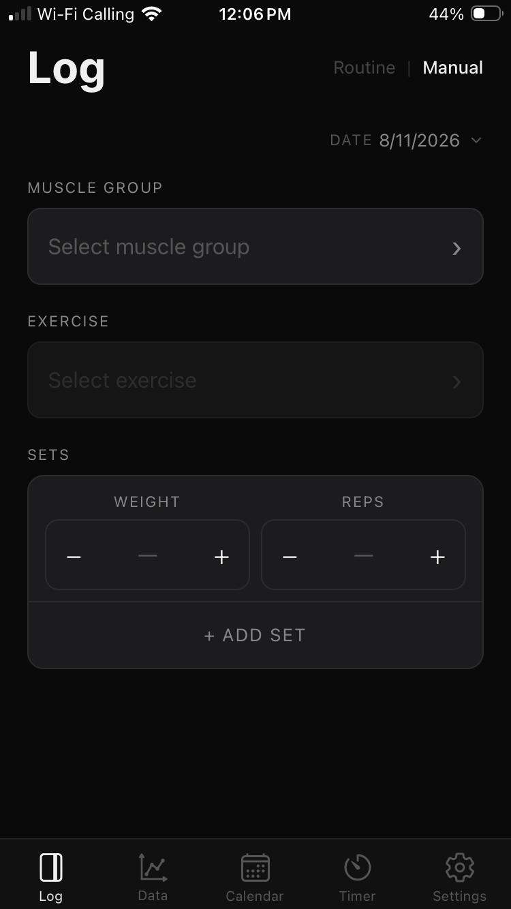
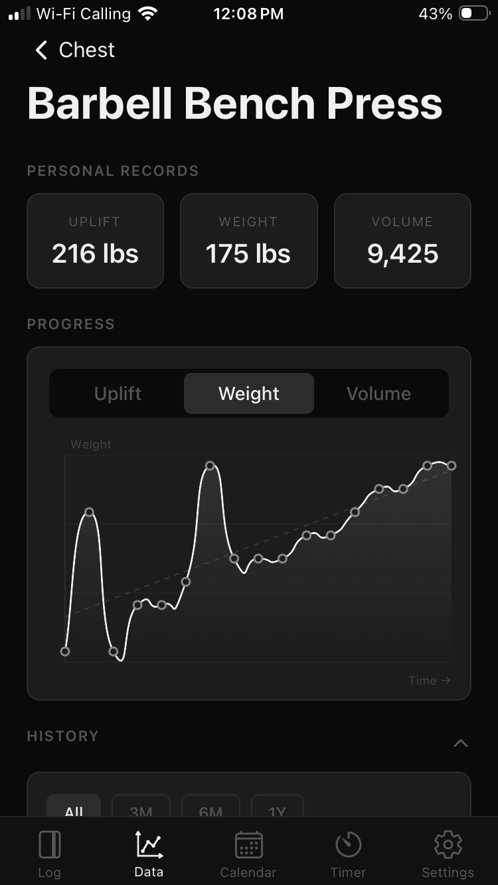
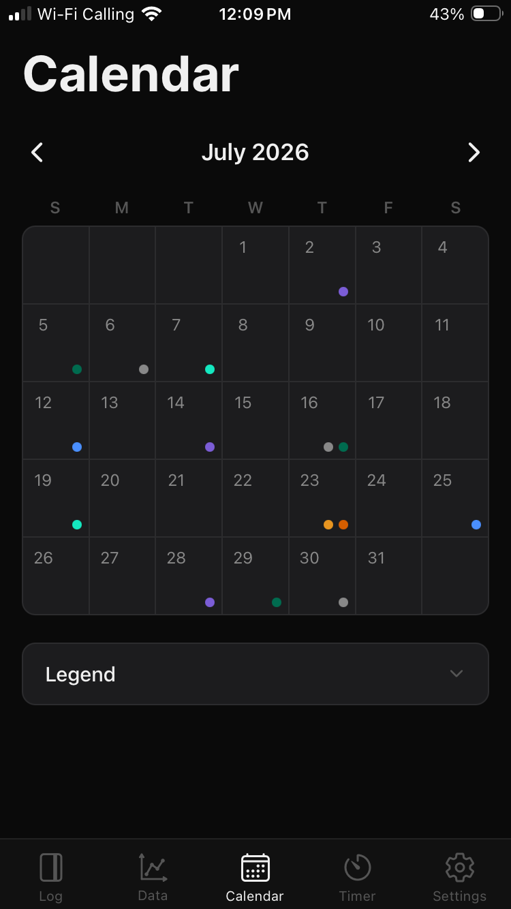

# About Me

[Resume Download](https://github.com/A-Ingrassia/A-Ingrassia/blob/main/Andrew_Ingrassia_Resume.pdf)

Hello, my name is Andrew Ingrassia.

I currently work as a Billing Solutions Analyst at Charter Communications, where I configure and update billing systems and execute and adapt SQL queries to support system updates and data accuracy. I also conduct peer reviews to maintain quality standards under production deadlines.

Beyond my core responsibilities, I identified a gap in how my team's process was documented and tooled — no SOPs, no automation — and taught myself to close it. I directed the design and build of a suite of automation tools and a project-tracking dashboard using AI-assisted development, and lobbied for my team to gain access to an agentic AI coding tool that made that work possible. That effort has since spread to other teams on my floor.

I'm a U.S. Army National Guard veteran (infantry and combat medic, six years of service) and previously ran an independent painting business for a decade before moving into data work.

I'm now focused on advancing into a Data Analyst or Billing Systems Analyst role where I can keep building on this foundation.

# Projects
### 1. Billing Process Automation & Dashboard (proprietary/internal)
- Identified and addressed a gap in an undocumented, high-context billing process — no prior SOPs, no automation
- Directed the build of a project-tracking dashboard and a suite of 4 Python-based tools using AI-assisted development, automating manual steps including SQL query execution for recurring tasks
- Authored the first written documentation and SOPs for the workflow

### 2. Uplift
- A workout tracker built around progressive overload — log workouts, track progress via visualized trends, integrated calendar and timers
- Data stored locally and synced via the user's own cloud, prioritizing data ownership
- Made independent UI/UX design decisions after evaluating competitor apps; built using Claude Code

  

  
Screenshots

  
  
  

  

### 3. Risk-Dice-GUI
- A multi-function GUI application designed to replace physical dice when playing the board game "Risk," written independently in Python before AI-assisted coding tools were in common use
